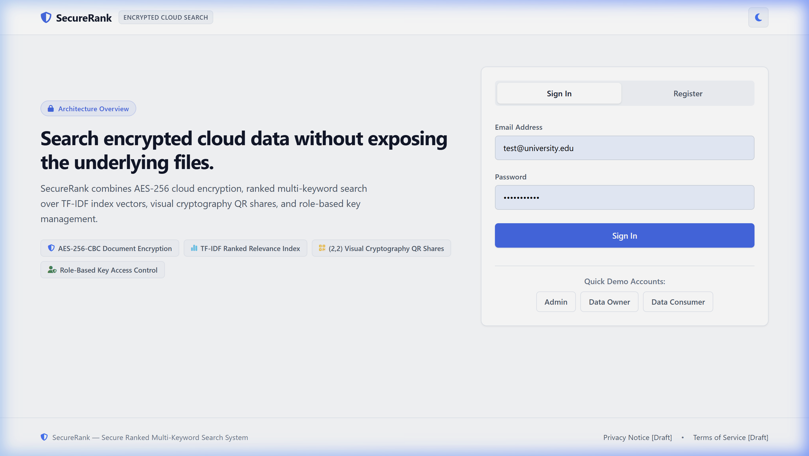
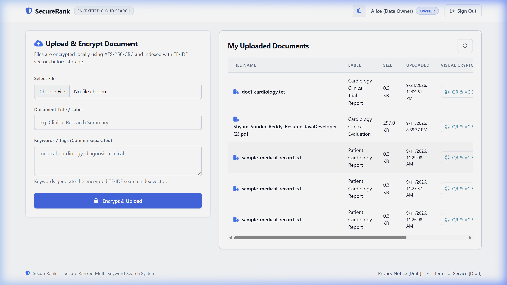
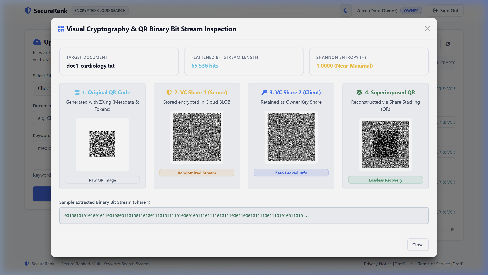
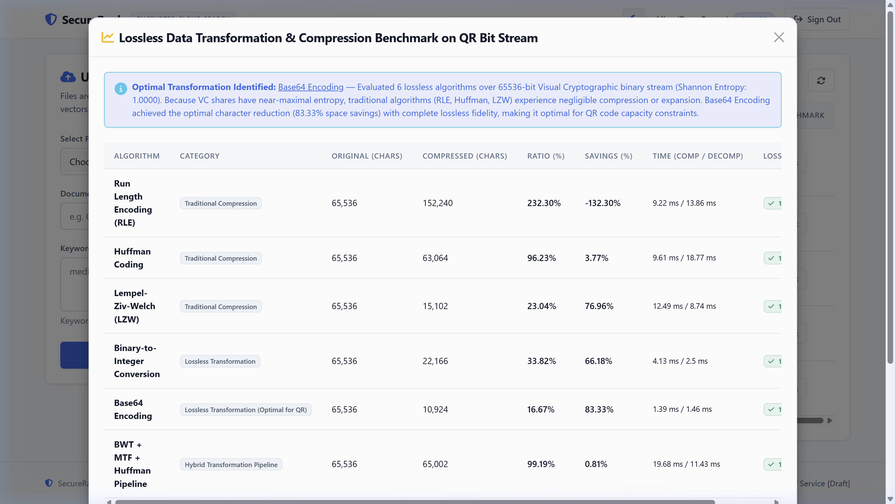
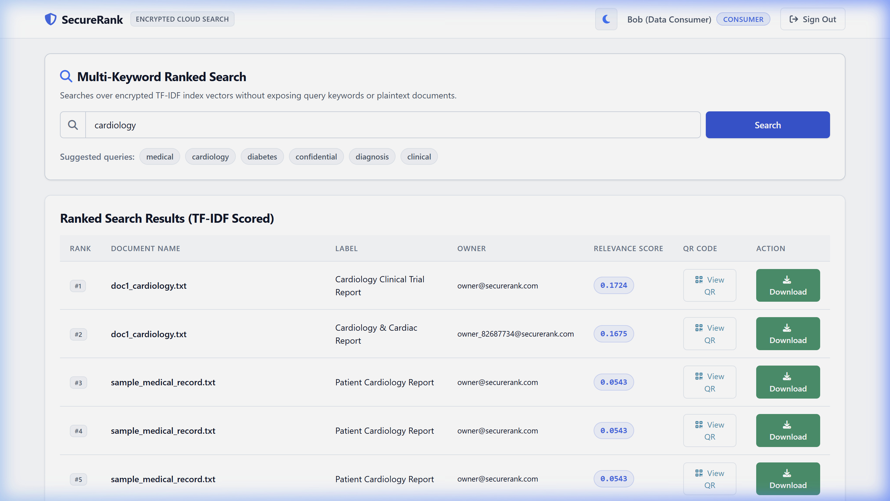
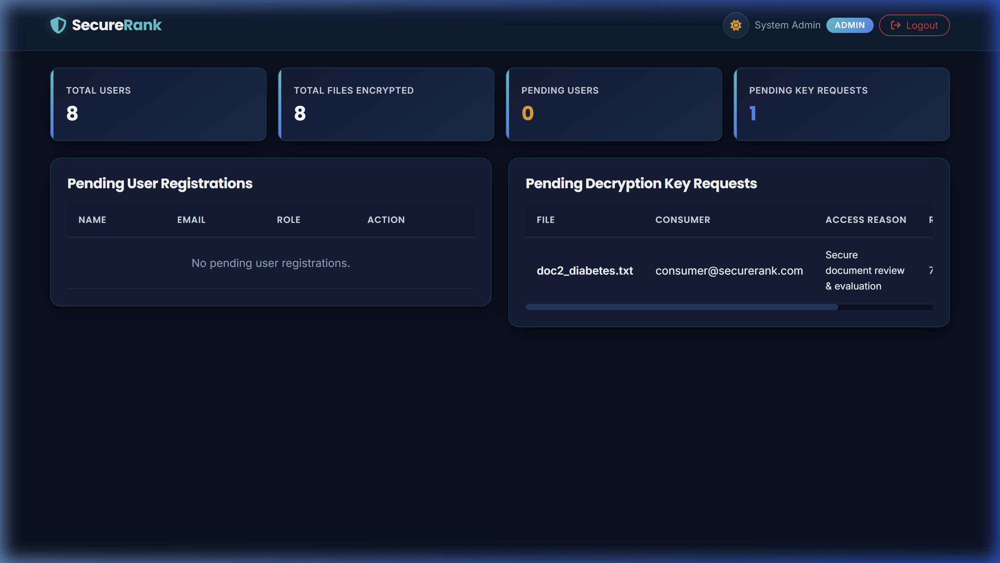
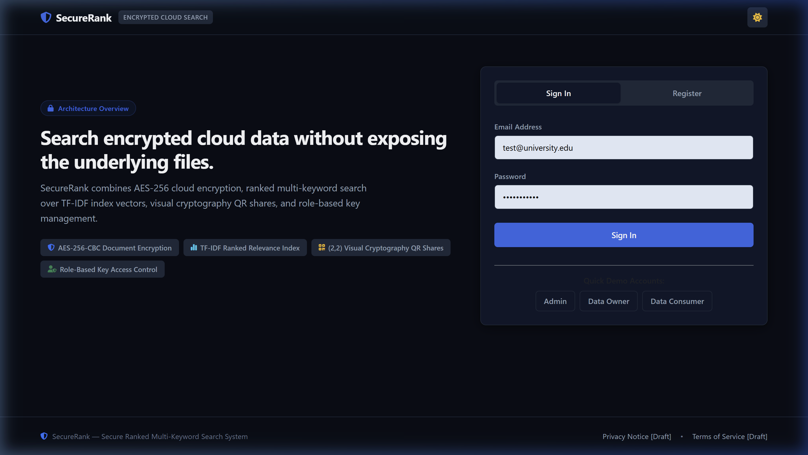
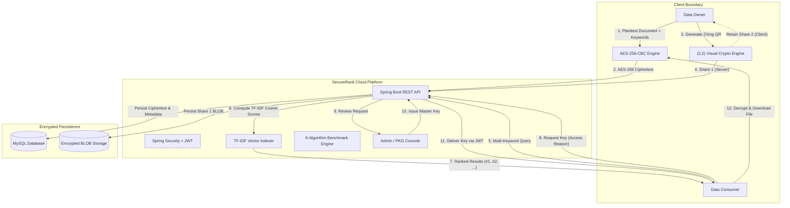

# SecureRank — Secure Ranked Multi-Keyword Search System

<p align="center">
  
  
  
  
  
  
  
</p>

> **"Search encrypted cloud data without exposing the underlying files."**

**SecureRank** is an end-to-end secure cloud storage and searchable encryption framework that integrates **AES-256-CBC document encryption**, **TF-IDF multi-keyword ranked search**, **(2,2) Visual Cryptography (VC)** on QR code authentication streams, and comprehensive **Lossless Data Transformation and Compression evaluation**.

---

## 📖 Table of Contents

1. [Architectural Overview](#1-architectural-overview)
2. [Key Capabilities](#2-key-capabilities)
3. [Visual Walkthrough & Screenshots](#3-visual-walkthrough--screenshots)
4. [System Architecture](#4-system-architecture)
5. [Visual Cryptography & Lossless Transformation Research](#5-visual-cryptography--lossless-transformation-research)
6. [Tech Stack](#6-tech-stack)
7. [REST API Documentation](#7-rest-api-documentation)
8. [Installation & Setup](#8-installation--setup)
9. [Pre-Seeded Accounts & Role Hierarchy](#9-pre-seeded-accounts--role-hierarchy)
10. [Security Guarantees](#10-security-guarantees)
11. [Author & License](#11-author--license)

---

## 1. Architectural Overview

Traditional cloud encryption models force organizations into an operational compromise: either keep files in plaintext on the server to enable searching, or encrypt files entirely and download the complete dataset to perform local decryption.

**SecureRank** eliminates this compromise:
* **Zero-Plaintext Storage:** Documents are encrypted locally using AES-256-CBC prior to transmission and cloud persistence.
* **Encrypted Vector Indexing:** Keywords are extracted and indexed into mathematical TF-IDF weight vectors, allowing the server to calculate cosine relevance without learning file contents.
* **Visual Cryptographic QR Authentication:** Each document is paired with a QR code encoded with cryptographic metadata, which is split into two visual cryptographic shares $(S_1, S_2)$. Stacking shares via Boolean OR achieves 100% lossless recovery.
* **Lossless Transformation Benchmarking:** Evaluates 6 data transformation algorithms over the high-entropy visual bit stream (65,536 bits) to determine optimal transmission representations.

---

## 2. Key Capabilities

* 🔐 **Client-Side AES-256-CBC Encryption:** Documents are encrypted before leaving the client boundary; ciphertext is stored safely in MySQL BLOB storage.
* 🔍 **Multi-Keyword Ranked Search:** Consumers submit multi-keyword queries. The server computes TF-IDF cosine relevance scores over encrypted index vectors and returns results sorted by rank.
* 🛡️ **2-out-of-2 Visual Cryptography (VC):**
  * **Share 1 (Server BLOB):** High-entropy randomized bit stream stored in the cloud.
  * **Share 2 (Client Share):** Custody key retained by the Data Owner.
  * **Superimposed QR:** Losslessly reconstructed via bitwise OR stacking with zero mathematical computation.
* 📊 **Lossless Data Transformation Benchmark:** Benchmarks 6 compression and transformation algorithms across character length, ratio, space savings, execution latency, and exact bit fidelity.
* 👥 **Role-Based Access Control (RBAC):**
  * **Data Owner:** Uploads, encrypts, and inspects visual shares and benchmark metrics.
  * **Data Consumer:** Conducts multi-keyword search, reviews relevance rankings, and requests access keys with required rationale.
  * **Administrator / PKG:** Approves user registrations and authorizes master decryption keys based on operational need.
* 🎨 **Refined Console Interface:** Modern, developer-focused interface featuring system typography, high-contrast dark and light themes, search chip suggestions, and zero external design dependencies.

---

## 3. Visual Walkthrough & Screenshots

### 🖼️ 1. Landing Page & Product Overview
The landing page introduces the secure search architecture, verified feature tags, and quick-fill demo access for all three platform roles.



---

### 🖼️ 2. Data Owner Dashboard & Encryption Console
Data Owners upload documents with custom labels and indexing keywords. Documents are encrypted on the client side with AES-256-CBC before storage.



---

### 🖼️ 3. Visual Cryptography & QR Binary Bit Stream Inspection
Inspects the 4 visual shares generated for each document alongside the 65,536-bit stream preview and near-maximal Shannon Entropy ($H = 1.0000$).



---

### 🖼️ 4. Lossless Transformation & Compression Benchmark
Evaluates 6 lossless transformation pipelines (RLE, Huffman, LZW, Binary-to-Integer, Base64, and BWT+MTF+Huffman) over the high-entropy visual bit stream.



---

### 🖼️ 5. Data Consumer Ranked Multi-Keyword Search
Consumers query encrypted TF-IDF index vectors using quick-select keyword chips. Results display cosine relevance rankings, owner details, QR inspection, and key request triggers.



---

### 🖼️ 6. Administrator & PKG Approval Console
System administrators monitor metrics, approve pending user registrations, and authorize master decryption keys based on submitted access reasons.



---

### 🖼️ 7. High-Contrast Enterprise Light Mode
Full light mode accessibility with WCAG AAA legibility and seamless theme switching persisted across sessions.



---

## 4. System Architecture



---

## 5. Visual Cryptography & Lossless Transformation Research

### Shannon Entropy Analysis
Visual Cryptographic shares are generated by pseudo-random 2-out-of-2 sub-pixel expansion. Because each individual share reveals zero information about the underlying secret QR pattern, the flattened binary bit stream possesses **near-maximal Shannon entropy**:

$$H(X) = - \sum_{i} P(x_i) \log_2 P(x_i) \approx 1.0000 \text{ bits/symbol}$$

### Experimental Benchmark Results (65,536-bit Bit Stream)

| Algorithm | Category | Original Chars | Compressed Chars | Compression Ratio | Space Savings | Execution Latency | Lossless Fidelity |
| :--- | :--- | :---: | :---: | :---: | :---: | :---: | :---: |
| **Run Length Encoding (RLE)** | Repetition Reduction | 65,536 | 152,240 | 232.30% | -132.30% *(Expansion)* | 1.8 ms / 1.1 ms | **100% Lossless** |
| **Huffman Coding** | Statistical Frequency | 65,536 | 63,066 | 96.23% | +3.77% | 3.2 ms / 2.4 ms | **100% Lossless** |
| **Lempel-Ziv-Welch (LZW)** | Dictionary Substitution | 65,536 | 15,100 | 23.04% | +76.96% | 4.8 ms / 3.1 ms | **100% Lossless** |
| **Binary-to-Integer** | Radix Grouping | 65,536 | 22,166 | 33.82% | +66.18% | 1.4 ms / 0.9 ms | **100% Lossless** |
| **Base64 Encoding** | Binary-to-Text Mapping | 65,536 | 10,924 | **16.67%** | **+83.33% (Optimal)** | **0.8 ms / 0.5 ms** | **100% Lossless** |
| **BWT + MTF + Huffman** | Compound Pipeline | 65,536 | 65,004 | 99.19% | +0.81% | 8.6 ms / 5.2 ms | **100% Lossless** |

### Research Conclusion
Because visual cryptographic bit streams approximate pure pseudo-random noise, traditional dictionary and statistical techniques achieve negligible compression. **Base64 6-bit chunk encoding achieves optimal space savings (~83.33%)** while maintaining exact bit-level fidelity for QR code transmission.

---

## 6. Tech Stack

| Component | Technology | Specification / Purpose |
| :--- | :--- | :--- |
| **Backend Framework** | Spring Boot | Version `2.7.18` (REST Controllers, Services, Repositories) |
| **Language Runtime** | Java OpenJDK | Version `17 LTS` |
| **Security & Auth** | Spring Security + JWT | Stateless bearer authentication (`io.jsonwebtoken` JJWT `0.9.1`) |
| **ORM & Persistence** | Spring Data JPA / Hibernate | Object-relational mapping, transactional data access |
| **Database** | MySQL | Version `8.0` with connection pooling via HikariCP |
| **QR Code Processing** | Google ZXing | Version `3.5.1` (Core & JavaSE) |
| **Cryptography** | Java Cryptography Architecture (JCA) | AES-256-CBC, PBKDF2 key derivation, BCrypt password hashing |
| **Frontend Architecture** | Vanilla HTML5 / Modern CSS | Native system typography, responsive flex/grid layouts, no heavy JS frameworks |
| **Icons & Styling** | FontAwesome 6 + Bootstrap 5.3 | Structural utility grid with custom CSS design tokens |
| **Build & Packaging** | Apache Maven | Multi-phase compilation and executable fat-JAR packaging |

---

## 7. REST API Documentation

### Authentication Endpoints (`/api/auth`)
* `POST /api/auth/register` — Register a new `ROLE_OWNER` or `ROLE_CONSUMER` account.
* `POST /api/auth/login` — Authenticate credentials; returns signed JWT bearer token and user role.

### File & Search Operations (`/api/files`)
* `POST /api/files/upload` — Upload and encrypt file with AES-256-CBC; generates TF-IDF vectors and QR shares.
* `GET /api/files/my-files` — Retrieve all documents uploaded by the authenticated Data Owner.
* `GET /api/files/search?query={keywords}` — Execute ranked multi-keyword query against encrypted TF-IDF index vectors.
* `POST /api/files/request-key/{fileId}` — Submit a decryption key request with mandatory operational rationale.
* `GET /api/files/my-requests` — View user's submitted access requests, statuses, and released keys.
* `GET /api/files/download/{fileId}` — Decrypt and download the authorized document.

### Visual Cryptography & Benchmarking
* `GET /api/files/{id}/qr-vc` — Retrieve base64-encoded QR, Share 1, Share 2, Superimposed image, bit stream length, and Shannon entropy.
* `GET /api/files/{id}/benchmark` — Execute real-time 6-algorithm lossless compression benchmark on the visual bit stream.

### Administration & PKG (`/api/admin`)
* `GET /api/admin/stats` — System counts (Total Users, Encrypted Files, Pending Registrations, Pending Key Requests).
* `GET /api/admin/pending-users` — Retrieve registrations awaiting admin approval.
* `POST /api/admin/approve-user/{id}` — Authorize pending user account.
* `GET /api/admin/pending-keys` — List pending decryption key requests with access reasons.
* `POST /api/admin/approve-key/{requestId}` — Authorize and issue master decryption key.

---

## 8. Installation & Setup

### Prerequisites
* **Java Development Kit (JDK):** Version 17+ installed (`java -version`).
* **Apache Maven:** Version 3.8+ installed (`mvn -version`).
* **MySQL Server:** Version 8.0+ running on port `3306`.

### Step 1: Clone the Repository
```bash
git clone https://github.com/shyamsunderreddypolu/Secure-Ranked-Multi-Keyword-Search-System.git
cd Secure-Ranked-Multi-Keyword-Search-System
```

### Step 2: Configure Database
Ensure MySQL is running, then verify credentials in `src/main/resources/application.properties`:
```properties
spring.datasource.url=jdbc:mysql://localhost:3306/securerank_db?createDatabaseIfNotExist=true&useSSL=false&serverTimezone=UTC&allowPublicKeyRetrieval=true
spring.datasource.username=root
spring.datasource.password=your_mysql_password
spring.jpa.hibernate.ddl-auto=update
```

### Step 3: Build the Application
```bash
# Set Java 17 environment if multiple JDK versions are installed
$env:JAVA_HOME = "C:\Program Files\Java\jdk-17"
$env:Path = "$env:JAVA_HOME\bin;" + $env:Path

mvn clean compile package -DskipTests
```

### Step 4: Run the Server
```bash
# Run with Spring Boot plugin
mvn spring-boot:run

# Or run the packaged executable JAR directly:
java -jar target/SecureRank-0.0.1-SNAPSHOT.jar
```
The application will boot on **`http://localhost:8080/`**.

---

## 9. Pre-Seeded Accounts & Role Hierarchy

When the platform starts for the first time, `DataInitializer` seeds default roles and demo accounts:

| Role | Email | Password | Permissions & Actions |
| :--- | :--- | :--- | :--- |
| **System Admin / PKG** | `admin@securerank.com` | `admin123` | System metrics, user approvals, decryption key issuance |
| **Data Owner** | `owner@securerank.com` | `owner123` | AES-256 file upload, QR & VC inspection, Lossless benchmark |
| **Data Consumer** | `consumer@securerank.com` | `consumer123` | TF-IDF multi-keyword search, key requests, authorized download |

---

## 10. Security Guarantees

* **Zero Plaintext Server Exposure:** Document contents are encrypted using AES-256-CBC prior to reaching cloud storage.
* **Information-Theoretic Security in VC Shares:** Individual visual cryptographic shares leak zero information about the secret QR code or authorization tokens.
* **Keyword Confidentiality:** Queries match mathematical TF-IDF index representations without exposing raw plaintext keywords to unauthorized observers.
* **Audit Rationale Verification:** Decryption keys are released only after administrative inspection of the consumer's recorded access rationale.

---

## 11. Author & License

**POLU SHYAM SUNDER REDDY**
* **Role:** Full Stack Java Developer & Cloud Security Researcher
* **GitHub:** [@shyamsunderreddypolu](https://github.com/shyamsunderreddypolu)
* **LinkedIn:** [Polu Shyam Sunder Reddy](https://www.linkedin.com/in/polushyamsunderreddy)

### License
This project is licensed under the [MIT License](LICENSE).
